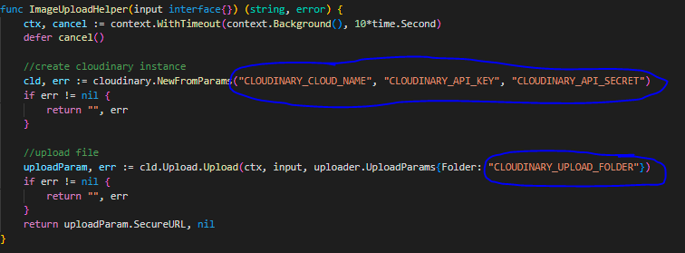

# Go Cloudinary Simple Code

# 🛠️ How to Run Locally

- Clone it

```
$ git clone https://github.com/fauzilax/go-cloudinary-simple.git
```

- Go to directory

```
$ cd go-cloudinary-simple
```
- Get API KEY

first we need to log in or sign up into our <a href="https://cloudinary.com/" >Cloudinary</a> account to get our Cloud Name, API Key, and API Secret. 
then we need to create a folder to store our media uploads so now we got the Cloudinary Folder Name

so now we got all api for fill this


- Run the project
```
$ go run .
```
- For Original Source

<a href="https://dev.to/hackmamba/robust-media-upload-with-golang-and-cloudinary-echo-version-5cd8" >Link</a>

Thanks to Demola Malomo for Hackmamba
